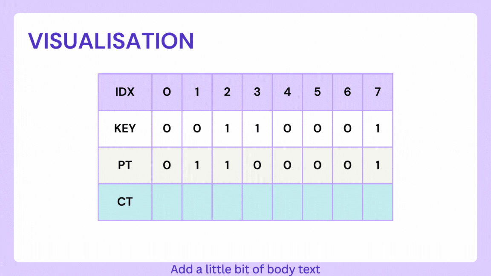

# Bit Scrambling Cipher

A bit scrambling cipher algorithm for stream encryption and decryption.

## Visulalisation


## How it works?
The Bit Scrambling Cipher algorithm is a stream cipher that operates on binary data. It takes a key as input and uses it to encrypt and decrypt messages. Here's the algorithm explained step by step:

1. Import the necessary libraries and define the `bitVector` type using `std::vector<bool>`.
2. Define helper functions `stringToBitVector` and `bitVectorToString` to convert strings to bit vectors and vice versa.
3. Define the class `StreamCipherAlgorithm` to encapsulate the cipher functionality.
4. The constructor of `StreamCipherAlgorithm` takes a `key` as input and initializes the key member variable with it. It also converts the key into a bit vector using the `stringToBitVector` helper function and stores it in the `key_in_bit_vector` member variable.
5. The `encrypt` method of `StreamCipherAlgorithm` takes a message as input and returns the encrypted ciphertext. It operates as follows:
    * Convert the message into a bit vector using the `stringToBitVector` helper function.
    * Create an empty bit vector called `cipher_in_bit_vector` with the same size as the message.
    * Initialize pointers `p`, `q`, `r`, and `s` to iterate over the message, key bit vector, ciphertext bit vector, and a pointer to the previous element in the ciphertext bit vector.
    * Iterate over each bit in the message:
        * If the current bit of the key is 1, copy the corresponding bit from the message to the ciphertext and move the `r` pointer.
        * If the current bit of the key is 0, invert the current bit of the message and copy it to the ciphertext using the s pointer, then move the `s` pointer.
        * Move the `p` and `q` pointers to the next bit in the message and key bit vector, respectively.
        * If the end of the key is reached, reset the `q` pointer to the beginning of the key.
    * Convert the ciphertext bit vector to a string using the `bitVectorToString` helper function and return it as the encrypted ciphertext.
6. The `decrypt` method of `StreamCipherAlgorithm` takes a ciphertext as input and returns the decrypted message. It operates in a similar manner to the `encrypt` method:
    * Convert the ciphertext into a bit vector.
    * Create an empty bit vector called `msg_in_bit_vector` with the same size as the ciphertext.
    * Initialize pointers `p, q, r`, and `s` to iterate over the message, key bit vector, ciphertext bit vector, and a pointer to the previous element in the ciphertext bit vector.
    * Iterate over each bit in the ciphertext:
        * If the current bit of the key is 1, copy the corresponding bit from the ciphertext to the message and move the `p` pointer.
        * If the current bit of the key is 0, invert the current bit of the ciphertext using the `s` pointer and copy it to the message, then move the `s` pointer.
        * Move the `p` and `q` pointers to the next bit in the message and key bit vector, respectively.
        * If the end of the key is reached, reset the `q` pointer to the beginning of the key.
    * Convert the message bit vector to a string using the `bitVectorToString` helper function and return it as the decrypted message.

This algorithm implements a simple stream cipher that scrambles the bits of the input message based on the key. It uses `XOR operations` to modify the bits of the message, providing a form of encryption and decryption.


## Description

This algorithm performs bit scrambling encryption and decryption on a given message using a key. The encryption process scrambles the bits of the message, while the decryption process reverses the scrambling to retrieve the original message.

Installation

1. Clone the repository:
    ```
    git clone https://github.com/your-username/bit-scrambling-cipher.git
    ```

2. Navigate to the project directory:
    ```
    cd bit-scrambling-cipher
    ```

3. Build the project:
    ```
    make
    ```

## Usage

1. Import the `StreamCipherAlgorithm` class from the `bit_scrambling_cipher.h` header file into your code.

2. Create a `StreamCipherAlgorithm` object by providing a key:
    ```
    StreamCipherAlgorithm cipher("your-key");
    ```
3. Encrypt a message:
    ```
    std::string encrypted = cipher.encrypt("your-message");
    ```
4. Decrypt a cipher text:
    ```
    std::string decrypted = cipher.decrypt("your-cipher-text");
    ```

## Examples

Encrypting a message:
```
#include <iostream>
#include "bit_scrambling_cipher.h"

int main() {
    StreamCipherAlgorithm cipher("your-key");

    std::string message = "Hello, World!";
    std::string encrypted = cipher.encrypt(message);

    std::cout << "Encrypted: " << encrypted << std::endl;

    return 0;
}
```

Decrypting a cipher text:
```
#include "bit_scrambling_cipher.h"

int main() {
    StreamCipherAlgorithm cipher("your-key");

    std::string cipherText = "your-cipher-text";
    std::string decrypted = cipher.decrypt(cipherText);

    std::cout << "Decrypted: " << decrypted << std::endl;

    return 0;
}
```

## Contributing

Contributions are welcome! Please feel free to submit a pull request.

## Acknowledgements

This project uses the following libraries:

[Paper: An Encryption and Decryption Algorithm Based on Random Dynamic Hash and Bits Scrambling](https://ieeexplore.ieee.org/document/9258781)

For any inquiries or suggestions, please contact abhinavbelhekar01@gmail.com or visit [coderabhinav.github.io](http://coderabhinav.github.io).

## License

This project is licensed under the MIT License.

Copyright 2023 (Abhinav Belhekar)

Permission is hereby granted, free of charge, to any person obtaining a copy of this software and associated documentation files (the “Software”), to deal in the Software without restriction, including without limitation the rights to use, copy, modify, merge, publish, distribute, sublicense, and/or sell copies of the Software, and to permit persons to whom the Software is furnished to do so, subject to the following conditions:

The above copyright notice and this permission notice shall be included in all copies or substantial portions of the Software.

THE SOFTWARE IS PROVIDED “AS IS”, WITHOUT WARRANTY OF ANY KIND, EXPRESS OR IMPLIED, INCLUDING BUT NOT LIMITED TO THE WARRANTIES OF MERCHANTABILITY, FITNESS FOR A PARTICULAR PURPOSE AND NONINFRINGEMENT. IN NO EVENT SHALL THE AUTHORS OR COPYRIGHT HOLDERS BE LIABLE FOR ANY CLAIM, DAMAGES OR OTHER LIABILITY, WHETHER IN AN ACTION OF CONTRACT, TORT OR OTHERWISE, ARISING FROM, OUT OF OR IN CONNECTION WITH THE SOFTWARE OR THE USE OR OTHER DEALINGS IN THE SOFTWARE.
